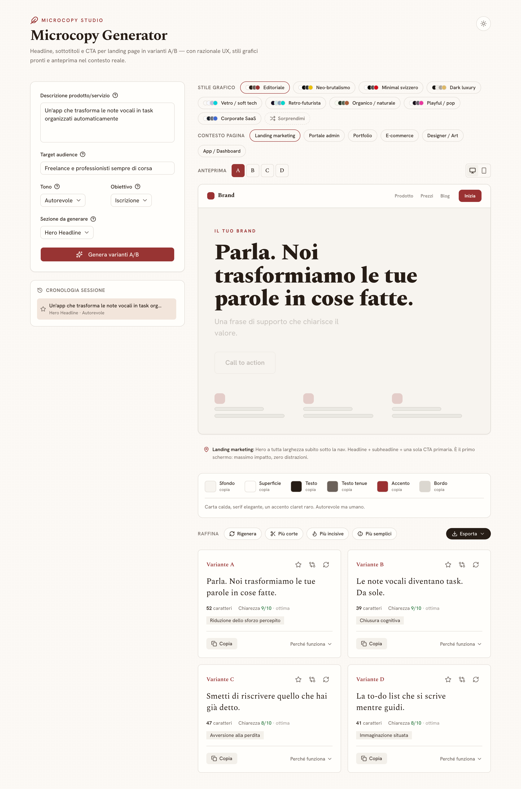
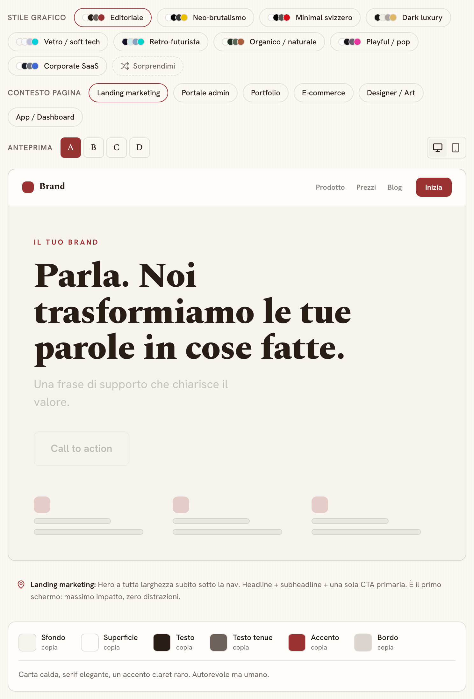

<h1 align="center">Microcopy Generator</h1>
<p align="center"><em>Generate landing-page headlines, subheadlines and CTAs as A/B variants — each one with its UX rationale and the psychological principle behind it.</em></p>

<p align="center">
  
  
  
  
  
</p>

<p align="center"></p>

Most AI copy tools hand you a list of sentences and leave you to guess which one to ship. Microcopy
Generator answers the other half of the question: for every variant it states the psychological
lever it pulls, why that specific wording works for that specific audience, and a clarity score you
can argue with. On top of the copy it ships a small design studio — nine visual style presets, six
page contexts, and a block-level hero editor — so you can see the words inside a real hero section
and export it as ready-to-paste HTML.

> Note: the interface and the generated copy are in Italian — the prompt instructs the model to
> write all output in Italian.

## Features

- **A/B variants with a rationale, not just text** — every variant carries a UX rationale, a short
  psychological-principle label, a character count and a 1–10 clarity score.
- **Five landing-page sections** — hero headline, subheadline, CTA button, value proposition and
  social proof, each with its own length and style constraints baked into the prompt.
- **"Full hero" mode** — generates three internally coherent hero variants (headline + subheadline +
  CTA + value proposition + social proof) as a single block instead of five disconnected pieces.
- **Refine without retyping** — one-click *shorter*, *punchier*, *simpler* or *regenerate*; already
  generated texts are sent back as an "avoid" list so the model does not repeat itself.
- **Single-variant regeneration** — swap out just the variant you dislike and keep the rest.
- **Side-by-side A/B compare** — pick two variants and diff their text, principle, length and clarity.
- **Preview studio** — 9 curated OKLCH style presets (editorial, neo-brutalist, Swiss minimal, dark
  luxury, glass/soft-tech, retro-futurist, organic, pop, corporate SaaS) × 6 page contexts (marketing
  landing, admin portal, portfolio, e-commerce, designer/art, app dashboard), with desktop/mobile
  framing and a palette panel that explains the role of each swatch.
- **Block-level hero editor** — reorder, hide, retype and restyle each hero block (font family, size,
  weight, alignment, colour, spacing), then export `hero.html`, `hero.css` or a `hero-spec.md`.
- **Export everything** — copy as plain text, or download Markdown, CSV, JSON and a self-contained
  hero HTML file with Google Fonts wired in.
- **No browser storage** — history, favourites and the light/dark toggle live in memory for the
  session only; nothing is persisted client-side.

<p align="center"></p>

## Tech stack

| Layer | Choice |
|---|---|
| Framework | Next.js 14.2.35 (App Router, React 18, RSC enabled) |
| Language | TypeScript 5 |
| Styling | Tailwind CSS 3.4 + `tailwindcss-animate` + `tw-animate-css` |
| UI | shadcn/ui (`base-nova` style, neutral base, CSS variables) on `@base-ui/react` |
| Icons / toasts | `lucide-react` / `sonner` |
| Theming | `next-themes` (in-memory, no persistence) |
| Fonts | `next/font/google`: Spectral, Hanken Grotesk, Archivo, JetBrains Mono |
| Model | Groq via `groq-sdk` — `llama-3.3-70b-versatile` by default |

## Getting started

**Prerequisites:** Node.js 18+ and a Groq API key (get one at <https://console.groq.com/keys>).

```bash
npm install
cp .env.example .env.local   # then fill in GROQ_API_KEY
npm run dev                  # http://localhost:3000
```

| Script | What it does |
|---|---|
| `npm run dev` | Start the dev server |
| `npm run build` | Production build |
| `npm run start` | Serve the production build |
| `npm run lint` | ESLint via `next lint` |

Two runnable self-checks ship with the source and document their own invocation
(`npx tsx lib/schema.check.ts`, `npx tsx lib/hero-layout.check.ts`); they assert the model-output
parser and the hero layout/export builders.

## Configuration

| Variable | Required | What it does |
|---|---|---|
| `GROQ_API_KEY` | Yes | Groq API key, read server-side in the route handler. Without it `/api/generate` returns 500. |
| `GROQ_MODEL` | No | Overrides the model id. Defaults to `llama-3.3-70b-versatile`. |

Deployable on Vercel: set `GROQ_API_KEY` in the project's environment variables.

## How it works

One Node.js route handler, `POST /api/generate`, does all the model work — the key never reaches
the browser.

1. **Validate.** The handler hard-validates the body against literal unions (tone, goal, section),
   trims and truncates free text, and clamps the variant count to 1–4.
2. **Prompt.** `lib/prompt.ts` composes a system prompt (copywriting rules, banned claims, a menu of
   psychological principles, a strict JSON output contract) with per-tone, per-goal and per-section
   directives. Refinement directives and the "already generated, do not repeat" list are appended.
3. **Call.** `groq-sdk` runs the chat completion at `temperature: 0.8` with
   `response_format: { type: "json_object" }`.
4. **Parse defensively.** `lib/schema.ts` never trusts the model: it JSON-parses, and on failure
   falls back to a balanced-delimiter scanner that extracts the first `{...}`/`[...]` block out of
   surrounding prose. It accepts `{varianti:[…]}`, a bare array or a single object, tolerates key
   aliases, truncates the principle to a short label, re-derives variant letters from position, and
   recomputes the character count server-side. Unusable items are dropped; an empty result becomes
   a 502 instead of a broken UI.
5. **Render.** The client keeps all state in memory, holds the last 20 generations in a session
   history you can restore or favourite, and debounces submits by 700 ms as lightweight client-side
   rate limiting.

## Project structure

```
app/
  api/generate/route.ts   # the only server route: validation + Groq call
  layout.tsx  page.tsx    # fonts and providers; all client state lives in page.tsx
components/
  GeneratorForm  VariantCard  HeroVariantCard  ABCompare
  ResultsToolbar  HistoryPanel  EmptyState  PreviewStudio  HeroEditor
  preview/                # ContextFrame, HeroMock, PalettePanel
  ui/                     # shadcn/ui primitives
lib/
  prompt.ts               # system prompt + tone/goal/section directives
  schema.ts               # types, unions, tolerant model-output parsers
  design-presets.ts       # 9 OKLCH themes, 6 page contexts, font stacks
  hero-layout.ts          # editable hero model + HTML/CSS/Markdown builders
  export.ts               # Markdown / CSV / plain text / standalone hero HTML
```

## License

No license file is declared in this repository yet.
